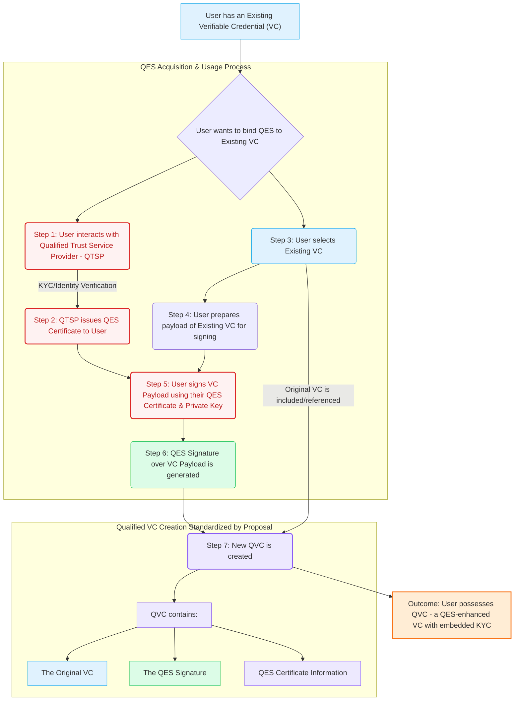

# Legally-Binding Proof of Personhood for Verifiable Credentials via QES

This proposal creates a standardized method to anchor Verifiable Credentials to legally recognized, high-assurance proof of an individual's identity through Qualified Electronic Signatures (QES). QES, recognized by eIDAS in the European Union, represent the highest level of electronic signature, carrying the same legal weight as a handwritten signature. By creating a standardized mechanism to attach a QES to any VC, we can bind that credential to the strong proof of personhood and KYC attributes inherent in the QES.

## Summary

We propose a verifiable credential schema tailored for decentralized applications that require proof of personhood, enabling a secure, tamper-proof and standardized format to bind any W3C Verifiable Credential to a Qualified Electronic Signature (QES). This brings a legally accepted Proof of Personhood to Verifiable Credentials in decentralized ecosystems.

## Problem

While Verifiable Credentials offer a flexible way to represent attributes and claims, there is currently no standardized method to anchor them to a legally recognized, high-assurance proof of an individual's identity. [Qualified Electronic Signatures (QES)](https://en.wikipedia.org/wiki/Qualified_electronic_signature), recognized by eIDAS in the European Union, represent the highest level of electronic signature, carrying the same legal weight as a handwritten signature. Obtaining a QES involves a rigorous identity verification process, effectively performing a strong Know Your Customer (KYC) check on the individual.

The absence of a standard way to bind a QES to a Verifiable Credential means that VCs, by themselves, may lack the necessary legal standing or the robust identity assurance required for high-value or legally sensitive transactions in decentralized ecosystems. By creating a standardized mechanism to attach a QES to any VC, we can bind that credential to the strong proof of personhood and KYC attributes inherent in the QES. This allows any existing or future VC to be "upgraded" with a legally binding attestation of the holder's identity, regardless of the VC's original content or issuer.

## Approach

We aim to standardize this foundational building block, unlocking a legally recognized Proof of Personhood across digital ecosystems, effectively allowing any VC to carry embedded KYC assurance.

This diagram illustrates the overall flow of how a user can bind a Qualified Electronic Signature (QES) to an existing Verifiable Credential (VC), resulting in a Qualified Verifiable Credential (QVC) that carries enhanced legal standing and embedded KYC assurance.

**Explanation of the Diagram:**

*   It starts with the **User** having an **Existing VC**.
*   The **"QES Acquisition & Usage Process"** subgraph details the interaction with the **QTSP**, the crucial **KYC/Identity Verification** step, obtaining the QES certificate, preparing the VC's payload, and the actual signing action using the QES.
*   The **"QVC Creation"** subgraph shows how the new standardized **QVC** is formed. This QVC incorporates the **Original VC** (or a reference to it), the **QES Signature** generated in the previous step, and relevant **QES Certificate Information**.
*   The final outcome is the User possessing this **QVC**, which now carries the strong legal assertion and embedded KYC value of the QES.

## Prior art

Unknown but unaware of a similar standard existing

## Unresolved Questions
