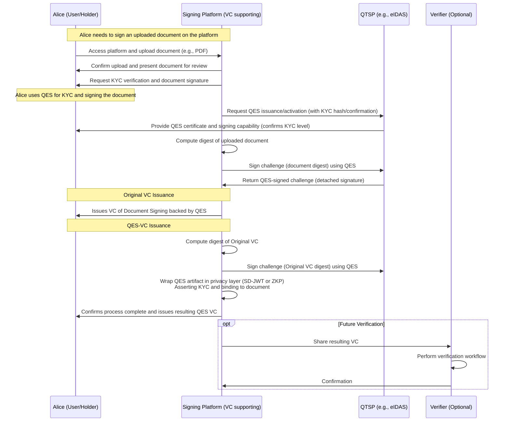

# Legally-Binding Proof of Personhood for Verifiable Credentials via QES

::: warning Warning Notice
  FIRST, VERY ROUGH DRAFT.
:::


## Abstract

This specification defines a mechanism for creating legally binding Verifiable Credentials (VCs) by binding them to Qualified Electronic Signatures (QES) under frameworks such as eIDAS 2.0. The approach utilizes a one-way cryptographic binding where the QES signs a digest of the VC as a challenge, ensuring the signer's verified identity (e.g., via KYC processes) is tied to the VC content without modifying the original VC. A new "Binding Credential" (a VC) serves as the umbrella structure, referencing the original VC and the QES-wrapped artifact via integrity-protected properties, enabling reusability, privacy-preserving measures through Selective Disclosure JSON Web Tokens (SD-JWT) or Zero-Knowledge Proofs (ZKPs), and offline-compatible verification.

## Introduction

Verifiable Credentials (VCs) as defined in the Verifiable Credentials Data Model 2.0 [VC-DATA-MODEL-2.0](https://www.w3.org/TR/vc-data-model-2.0/) provide a mechanism for asserting claims in a tamper-evident and privacy-respecting manner. However, in regulated environments requiring legal enforceability, such as under the European Union's eIDAS Regulation (EU) No 910/2014 and its 2.0 amendments, VCs must be bound to Qualified Electronic Signatures (QES) to achieve equivalence to handwritten signatures. This legal equivalence is established in [Article 25](https://www.legislation.gov.uk/eur/2014/910/article/25) of the regulation, which states that a qualified electronic signature shall have the equivalent legal effect of a handwritten signature.

This specification introduces a one approach for achieving a one-way binding between a VC and a QES-backed identity attestation (e.g., incorporating a KYC hash). The binding ensures the VC is cryptographically approved by a verified signer without altering the VC's original signature payload. This avoids invalidation issues associated with direct modifications (e.g., adding references via `relatedResource` to the original). Instead, a new Binding Credential encapsulates the references, supporting privacy enhancements via SD-JWT or ZKPs.

### Motivation

Traditional VC issuance focuses on issuer signatures, but lacks inherent mechanisms for holder-bound legal commitments. In scenarios like contracts, attestations, or access rights, binding a VC to a QES provides non-repudiation and legal validity. The original concept emphasizes using QES to sign VC digests for binding, with privacy wrappers to minimize data exposure. This specification formalizes that into an interoperable method aligned with emerging standards like SD-JWT for Verifiable Credentials [SD-JWT-VC](https://www.ietf.org/archive/id/draft-ietf-oauth-selective-disclosure-jwt-22.html) and eIDAS 2.0 wallet integrations, using a reusable VC structure for persistence.

### Scope

This specification covers:
- One-way binding via QES challenge signatures.
- Enveloping via a new Binding Credential VC.
- Privacy-preserving wrappers using SD-JWT or ZKPs.
- Verification workflows, security, and privacy considerations.

Out of scope: Multi-party signatures, dynamic proof requests (e.g., via DIDComm), or non-eIDAS signature schemes.

### Conformance

As well as sections marked as non-normative, all authoring guidelines, diagrams, examples, and notes in this specification are non-normative. Everything else in this specification is normative.

The key words MAY, MUST, MUST NOT, OPTIONAL, RECOMMENDED, REQUIRED, SHALL, SHALL NOT, SHOULD, and SHOULD NOT in this document are to be interpreted as described in BCP 14 [RFC2119](https://www.rfc-editor.org/rfc/rfc2119) when, and only when, they appear in all capitals, as shown here.

## Terminology

This section defines the terms used in this specification. A link to these terms is included whenever they appear in the document.

- **Verifiable Credential (VC)**: A tamper-evident credential that has authorship that can be cryptographically verified, as defined in [VC-DATA-MODEL-2.0](https://www.w3.org/TR/vc-data-model-2.0/).
- **Binding Credential**: A specialized VC that references and binds an original VC to a QES artifact, serving as a reusable umbrella structure.
- **Qualified Electronic Signature (QES)**: An advanced electronic signature created by a qualified electronic signature creation device and based on a certificate provided by a Qualified Trust Service Provider (QTSP), as per eIDAS Regulation.
- **KYC Hash**: A cryptographic digest (e.g., SHA-256 or multihash) representing Know Your Customer (KYC) verification data, used for privacy-preserving identity attestation.
- **Challenge Signature**: A signature where the message signed includes a digest of another artifact (e.g., VC) as a challenge to bind the signer's identity.
- **Selective Disclosure JSON Web Token (SD-JWT)**: A JWT format enabling selective disclosure of claims, as per [SD-JWT](https://www.ietf.org/archive/id/draft-ietf-oauth-selective-disclosure-jwt-22.html).
- **Zero-Knowledge Proof (ZKP)**: A cryptographic method allowing one party to prove possession of information without revealing it, e.g., via BBS signatures [VC-BBS-2023](https://www.w3.org/community/reports/credentials/CG-FINAL-vc-di-bbs-20230405/).

## Binding Mechanism

### Overview

The binding is one-way: The QES attests to the VC by signing its digest, tying the signer's verified identity (e.g., KYC level) to the VC content. This avoids circular dependencies and preserves the VC's immutability. The QES is wrapped for privacy and referenced in a new Binding Credential for reusability.

### QES Challenge Signature

The QES MUST sign a message that includes:
- The digest of the VC JSON payload (e.g., using SHA-256).
- Optional metadata (e.g., timestamp, intent like "approve VC").

The signature format SHALL conform to eIDAS-qualified standards. The resulting QES artifact MAY include the qualified certificate chain for verification.

**Algorithm**:
1. Compute `vcDigest = hash(serialize(VC))` where `hash` is SHA-256 or a multihash.
2. Construct challenge message: `{ "challenge": vcDigest, "timestamp": ISO8601-time }`.
3. Sign the message with QES: `qesSignature = signQES(challengeMessage)`.

This creates a detached signature binding the QES holder's identity to the VC.

### Privacy Wrappers

To preserve privacy, the QES artifact SHALL be wrapped as:
- **SD-JWT**: Encode QES details (e.g., certificate thumbprint, signed challenge) with selective disclosure claims (e.g., `_sd` for hidden attributes). The SD-JWT MAY include a Key Binding JWT (KB-JWT) to prove holder possession.
- **ZKP**: Derive a proof from the QES using a supported cryptosuite (e.g., BBS for unlinkable proofs or CL-signatures via AnonCreds). The proof asserts predicates like "QES valid over vcDigest with KYC level >= 2" without revealing underlying data.

Wrappers MUST NOT expose unnecessary identity details, adhering to data minimization principles.

### Umbrella Structure: Binding Credential

The umbrella SHALL be a new VC conforming to [VC-DATA-MODEL-2.0](https://www.w3.org/TR/vc-data-model-2.0/), termed a Binding Credential:
- `type`: ["VerifiableCredential", "BindingCredential"] (extension type RECOMMENDED).
- `evidence`: An array of objects, each referencing:
  - The original VC (via URI, with `digestMultibase` for integrity).
  - The privacy-wrapped QES artifact (via URI or embedded as a data URI, with digest).
- Alternatively, use `relatedResource` for external integrity-protected references.
- Signed by the holder or a trusted issuer using a securing mechanism (e.g., JOSE for JWT/SD-JWT or DataIntegrityProof).

This structure ensures reusability, as the Binding Credential can be stored and presented like any VC.

**Example (JSON) -- TO BE UPDATED**:
```json
{
  "@context": ["https://www.w3.org/ns/credentials/v2"],
  "type": ["VerifiableCredential", "BindingCredential"],
  "id": "http://example.com/bindings/123",
  "issuer": "did:example:holder",
  "credentialSubject": {
    "id": "did:example:subject",
    "bindingDescription": "QES-bound University Degree"
  },
  "evidence": [
    {
      "type": ["VerifiableCredentialReference"],
      "id": "http://example.edu/credentials/3732",
      "digestMultibase": "z01... (multihash of original VC)"
    },
    {
      "type": ["QESArtifact"],
      "id": "data:application/sd-jwt;base64,... (wrapped QES)",
      "digestMultibase": "z01... (multihash of QES wrapper)"
    }
  ],
  "proof": {
    "type": "JsonWebSignature2020",
    // ... signature details
  }
}
```

## Verification Workflow

Verifiers SHALL:
1. Validate the Binding Credential's signature.
2. Fetch/resolve references in `evidence` or `relatedResource`.
3. Verify the original VC signature and match its digest.
4. Extract the wrapped QES artifact and verify:
   - The QES signature over the challenge.
   - That the challenge matches the VC digest.
   - QES certificate validity (e.g., via OCSP).
5. If using SD-JWT, process disclosures; for ZKPs, verify the proof predicates.

Verification MUST fail if any binding check mismatches.

## Examples

### Usecase Sequence Diagram



### Basic Binding Example (Non-Normative)

Consider a VC asserting a degree. The holder creates a QES signing the VC digest, wraps it in SD-JWT, and issues a Binding Credential referencing both for presentation to an employer.

### ZKP-Enhanced Binding (Non-Normative)

For high-privacy, use BBS to derive a ZKP from the QES, referenced in the Binding Credential's `evidence`, proving "valid QES over this VC digest."

## Security Considerations

- **Digest Collisions**: Use collision-resistant hashes (e.g., SHA-256); RECOMMEND multihash for flexibility.
- **Replay Attacks**: Include nonces or timestamps in challenges.
- **Certificate Revocation**: Verifiers MUST check QES status via CRL/OCSP.
- **Key Binding**: Use KB-JWTs to prevent unauthorized presentation.
- **Side-Channel Attacks**: Minimize metadata in references to avoid timing or correlation risks.

## Privacy Considerations

- **Data Minimization**: Use SD-JWT or ZKPs to disclose only necessary claims; reference rather than embed where possible.
- **Unlinkability**: ZKPs enable unlinkable proofs; avoid persistent identifiers in digests.
- **Consent**: Holders MUST control issuance and presentation; align with GDPR/eIDAS data protection.
- **Metadata Leakage**: Use anonymous URIs if references could enable tracking.

## IANA Considerations

This document has no IANA actions.

## Acknowledgements

This specification builds on concepts from decentralized identity labs proposals for beta-cohort-2-2025, incorporating feedback on QES-VC bindings and structure reusability.

## References

### Normative References

- [VC-DATA-MODEL-2.0](https://www.w3.org/TR/vc-data-model-2.0/) Verifiable Credentials Data Model v2.0. W3C Recommendation.
- [SD-JWT](https://www.ietf.org/archive/id/draft-ietf-oauth-selective-disclosure-jwt-22.html) Selective Disclosure for JWTs. IETF Draft.
- [RFC2119](https://www.rfc-editor.org/rfc/rfc2119) Key words for use in RFCs to Indicate Requirement Levels.
- [RFC8174](https://www.rfc-editor.org/rfc/rfc8174) Ambiguity of Uppercase vs Lowercase in RFC 2119 Key Words.

### Informative References

- [VC-BBS-2023](https://www.w3.org/community/reports/credentials/CG-FINAL-vc-di-bbs-20230405/) BBS Cryptographic Suites v0.01. W3C Draft Community Group Report.
- [SD-JWT-VC](https://www.ietf.org/archive/id/draft-ietf-oauth-selective-disclosure-jwt-22.html) SD-JWT for Verifiable Credentials. IETF Draft.
- [VC-DATA-INTEGRITY](https://www.w3.org/TR/vc-data-integrity/) Verifiable Credential Data Integrity 1.1. W3C Working Draft.